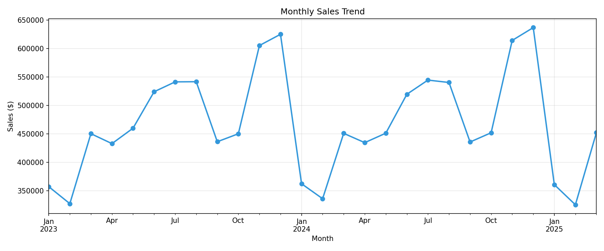
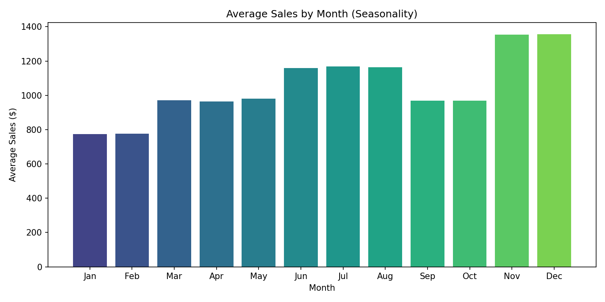
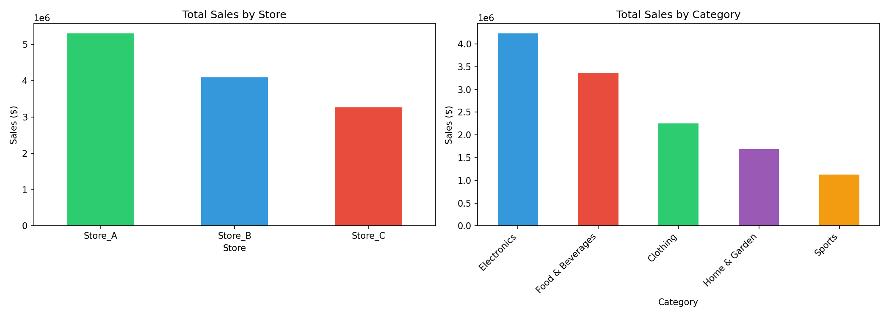
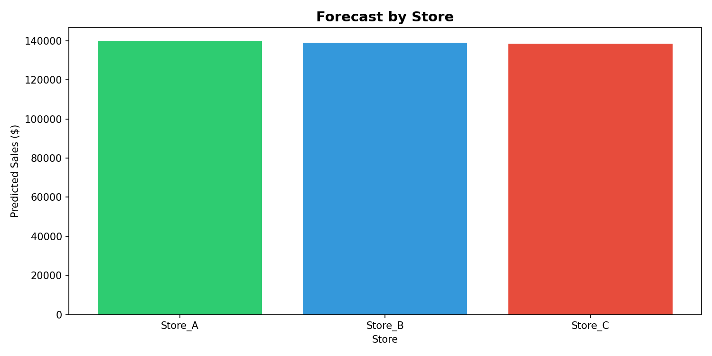
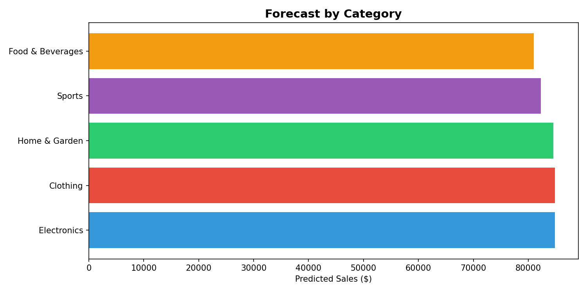
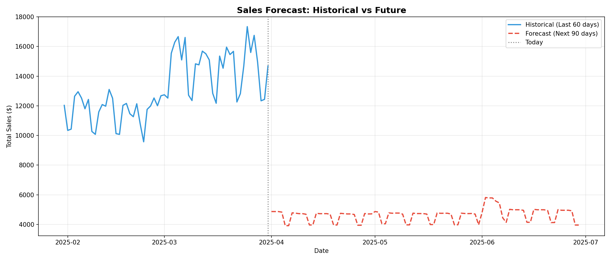
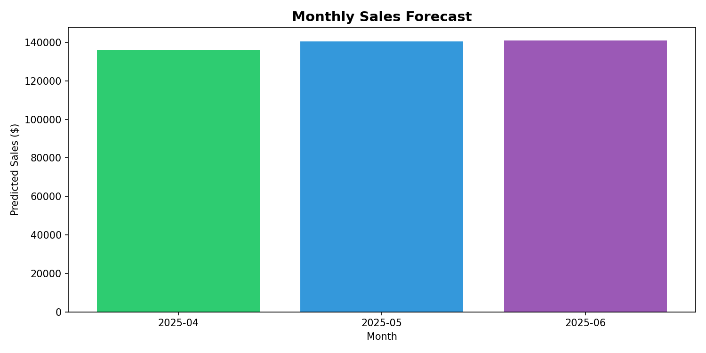

# 📊 Sales Demand Forecasting System

An end-to-end Machine Learning project that predicts future sales using historical data and presents insights through an interactive Streamlit dashboard.
🚀 End-to-end ML system for forecasting sales with 90-day predictions using advanced time-series feature engineering and interactive dashboarding.

---
## 🌐 Live Demo

🚀 Try the live application here:
👉 https://sales-demand-forecasting.streamlit.app/

---

Experience the full sales forecasting system in action:

* 📊 Explore historical sales trends
* 🔍 Analyze seasonality patterns
* 🤖 Train and compare ML models
* 🔮 View 90-day future sales forecasts

This interactive dashboard is designed for **business users and decision-makers** to easily understand and act on data insights.


## ❗ Problem Statement

Businesses often struggle to accurately predict future demand, leading to:

* Overstocking 📦
* Stock shortages 📉
* Poor inventory planning
* Financial inefficiencies

This project solves the problem by building a **data-driven sales forecasting system** that helps businesses make informed decisions.

---

## 🚀 Overview

This project implements a complete ML pipeline for sales forecasting, including:

* Data generation and preprocessing
* Advanced feature engineering
* Model training and evaluation
* Future sales prediction
* Interactive dashboard for visualization

The focus is not just on prediction accuracy, but also on **business interpretability and usability**.

---

## ✨ Features

* ✔ Time-based feature engineering (year, month, weekday, seasonality)
* ✔ Lag features and rolling statistics
* ✔ Multiple ML models (Linear, Ridge, Random Forest, Gradient Boosting)
* ✔ Model evaluation using MAE, RMSE, R², MAPE
* ✔ 90-day future sales forecasting
* ✔ Interactive Streamlit dashboard
* ✔ Business insights and recommendations

---

## 🛠️ Tech Stack

**Languages & Tools**

* Python
* Streamlit

**Libraries**

* Pandas
* NumPy
* Scikit-learn
* Matplotlib
* Joblib

---

## 📁 Project Structure

```bash
FUTURE_ML_01

├── app.py                 # Main Streamlit dashboard (ALL IN ONE)
├── requirements.txt       # Dependencies
├── README.md             # This file
├── data/                  # Data files
│   ├── sales_data.csv
│   └── processed_sales.csv
├── models/                # Trained models
│   └── best_model.pkl
├── output/                # Results
│   ├── forecast_results.csv
│   └── model_evaluation.csv
└── visualizations/        # Static charts (optional)
```

---

## ⚙️ How It Works

### 1. Data Preparation

* Historical sales data is generated (simulated real-world patterns)
* Data is cleaned and structured

### 2. Feature Engineering

* Time-based features (month, weekday, quarter)
* Cyclical encoding (sin/cos)
* Lag features and rolling statistics

### 3. Model Training

* Multiple regression models are trained
* Best model selected based on performance metrics

### 4. Forecasting

* Predicts future sales for the next 90 days

### 5. Visualization

* Results displayed through an interactive dashboard

---

## 📸 Demo & Visualizations

Below are key visual insights generated from the forecasting system:

### 📈 Monthly Sales Trend



### 🔄 Seasonality Analysis



### 🏬 Sales by Store & Category



---

## 🔮 Forecasting Insights

### 🏬 Forecast by Store



### 🛒 Forecast by Category



### 📅 Daily Sales Forecast (Next 90 Days)



### 📆 Monthly Forecast Trend



---

### 📊 What These Visualizations Show

* Sales trends over time (growth/decline patterns)
* Seasonal demand fluctuations across months
* Performance differences between stores and categories
* Future sales predictions for better planning

These visuals are designed to help **non-technical stakeholders** quickly understand business insights and make data-driven decisions.
## Results

| Model | R² Score | MAE ($) | MAPE (%) |
|-------|----------|---------|----------|
| Linear Regression | 0.7980 | 172.31 | 17.84 |
| Ridge Regression | 0.8442 | 165.19 | 17.14 |
| Random Forest | 0.8913 | 142.33 | 14.14 |
| **Gradient Boosting** | **0.8958** | **137.86** | **13.64** |

### Key Insights
- **Best Model:** Gradient Boosting (R² = 89.58%)
- **Top Feature:** 7-day rolling average (66.76% importance)
- **90-Day Forecast:** ~$417,543 total predicted sales

## 💡 Business Impact

This system helps businesses:

* 📦 Optimize inventory management
* 📉 Reduce overstocking and stockouts
* 👥 Improve staffing decisions
* 💰 Plan finances based on demand forecasts

---

## 🧠 Skills Demonstrated

* Machine Learning (Regression Models)
* Time-Series Feature Engineering
* Data Analysis & Visualization
* Streamlit Dashboard Development
* Business Problem Solving

---

## ⚡ Challenges & Learnings

* Handling time-based data correctly
* Creating lag and rolling features without data leakage
* Designing a system that balances accuracy and interpretability

---

## ▶️ Run Instructions

### 1. Clone the repository

```bash
git clone https://github.com/ravikiranediga/FUTURE_ML_01.git
cd FUTURE_ML_01
```

### 2. Install dependencies

```bash
pip install -r requirements.txt
```

### 3. Run the application

```bash
streamlit run app.py
```

## 👤 Author

**Ravi Kiran Ediga**
Aspiring Data Scientist | Machine Learning Enthusiast
